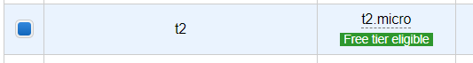

1. [https://us-east-2.console.aws.amazon.com/ec2/v2/home?region=us-east-2]()
1. 
1. 
1. 
1. 
1. 
1. 
1. Скачуємо ssh key
1. 
1. 
1. Клікаємо 
1. Копіюємо ІР 
1. Скачуємо термінал для підключення <https://mobaxterm.mobatek.net/download-home-edition.html> 
1. Відкриваємо MobaXTerm  

1. 
1. Вписуємо іп адрес та вказуємо юзернейм ubuntu 
1. Вибираємо ssh ключ який скачали в поли use private key
1. Клікаємо -> ОК 
1. Так виглядає все окей 
1. Клонуємо репозиторій командою 
   **git clone [https://github.com/Lucky-graf/DDoS_terraform_aws.git**](https://github.com/Lucky-graf/DDoS_terraform_aws.git)**
1. Переходимо в папку:

cd DDoS\_terraform\_aws/

1. **Запускаємо баш-скрипт для інсталяції Терраформу:**

sudo bash install\_terraform.sh

1. **Результат буде такий: **
1. **Перед запуском тераформ створимо користувача для нього:**

**(<https://console.aws.amazon.com/iamv2/home?#/users>) – тут сторінка із юзерами **

 	

`	`Далі теги лишаємо пусті і натискаємо  і далі 

`	`Копіюємо та зберігаємо Access та Secret key через два кроки будемо вводити

1. **Повертаємось до введення команд! Команди для старту терраформу:**
   terraform init 
1. ` `**terraform apply (тут треба ввести аксеси які ви отримали при створенні юзера в AWS)** 

1. **Підтверджуємо атаку **
1. **Успішний результати** 

**ТЕПЕР ТИ МОЧЕШ МОСКАЛЮК!
**

**ДОДАТКОВА ІНФОРМАЦІЯ:** 

**-щоб зупинити атаку (а це добре робити 50-60 хв після початку)  команад – terraform destroy**

**Успішний дестрой**

**Якщо потрібно почати атаку заново – знову terraform apply**

**СЛАВА УКРАЇНІ!!!
ГЕРОЯМ СЛАВА!!!**

