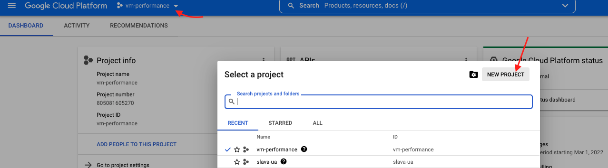
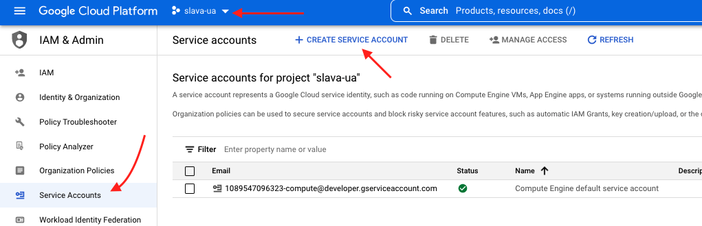
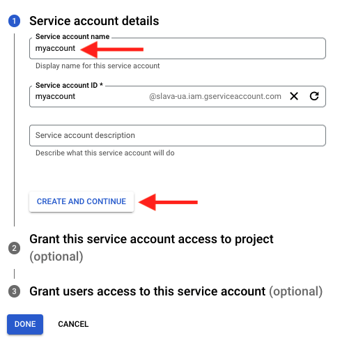
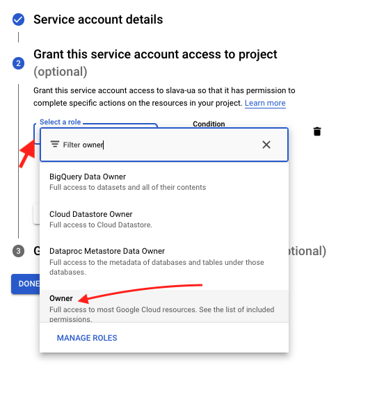
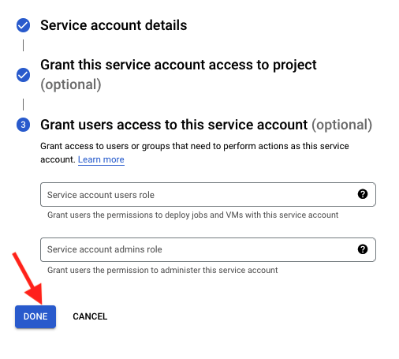
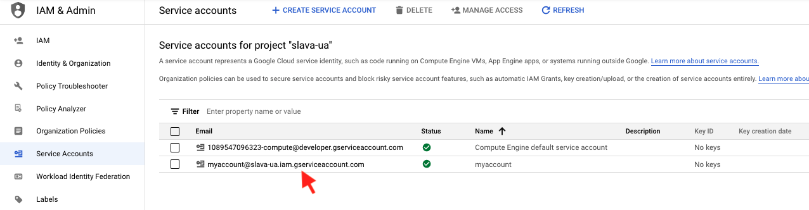
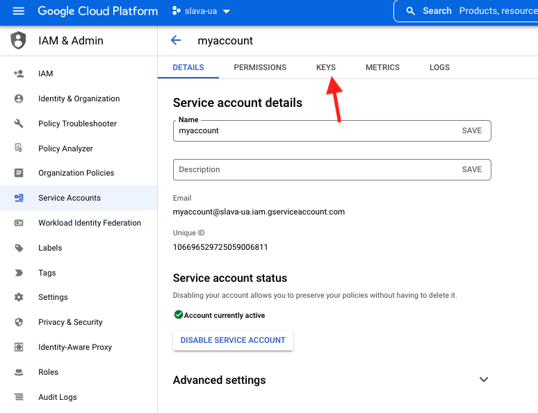
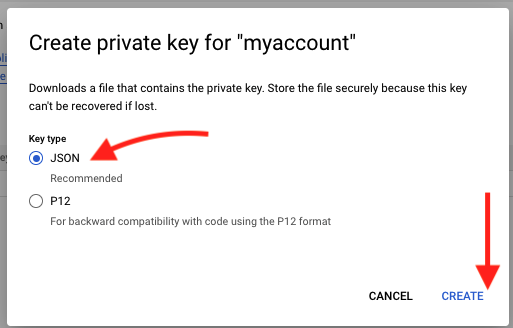

# DDOS via GCP 

## Преамбула

Перш за все, даний гайд слід використовувати виключно у навчальних цілях.

Усім новим користувачам GСP надає $300 для початку роботи. Саме за їх рахунок ми радимо проводити навчання.

[Реєстрація у GCP](https://www.youtube.com/watch?v=SwZEQiKdwq8)


## Початок роботи

1. Клонуємо репозиторій 
   **git clone [https://github.com/UA-TECH-POWER/DDoS_terraform_aws](https://github.com/UA-TECH-POWER/DDoS_terraform_aws)**
2. Переходимо в папку:

cd DDoS\_terraform\_aws/

## Встановлюємо terraform

* **Ubuntu**: Запускаємо баш-скрипт для інсталяції Терраформу
```bash
sudo bash install\_terraform.sh
```
* **OSX (brew)**
```bash
brew tap hashicorp/tap
brew install hashicorp/tap/terraform
```
* Інші платформи: йдемо по [лiнцi](https://www.terraform.io/downloads)

### Перевірка
```bash
terraform -v
```

## Перед запуском тераформ створимо користувача для нього

1. Створюємо проект у GCP (якщо не створили після реєстрації): https://console.cloud.google.com


2. Переходимо за посиланням та створюємо файл доступу (переконайтеся що зверху зліва вибраний раніше створений вами проект): https://console.cloud.google.com/iam-admin/serviceaccounts

Вводимо назву (будь-яку) -> Далі

Даємо рівень доступ власника (Owner)

Далі

Обираємо щойно створений сервіс акаунт

Переходимо до ключів

Створюємо новий ключ у форматі JSON

Зберігаємо його. Шлях до файлу пізніше знадобиться- збережіть його!



1. **Повертаємось до введення команд! Команди для старту терраформу:**
   terraform init 
2. ` `**(тут треба ввести ім'я створеного проекту та шлях до завантаженого сервіс-акаунту)**
 ``DDoS_terraform_aws/gcp/ddos.tf``
 
2.1 **nano ddos.tf (вводимо дані)**
```hcl
  project = "" # введіть ім'я проєкта що створили
  credentials = "" # повний шлях до завантаженого сервіс-акаунту
```
2.2**Для збереження Ctrl+O Enter**
2.3**Для виходу Ctrl+X** 
 
 ` `**terraform apply - На даному кроці обираємо ціль, кількість інстансів, порт** 


1. **Підтверджуємо атаку **
2. **Успішний результати** 


**ТЕПЕР ТИ МОЧЕШ МОСКАЛЮК!
**

**ДОДАТКОВА ІНФОРМАЦІЯ:** 

**-Щоб зупинити атаку команад – terraform destroy**
*Пропускаємо всі внесення змінних будь-якою цифрою*


**Якщо потрібно почати атаку заново – знову terraform apply**
## Най головніше слідкуємо за часом ти машин
**ЗА посиланням** *https://console.cloud.google.com/billing/*

# СЛАВА УКРАЇНІ!!!
# ГЕРОЯМ СЛАВА!!!
